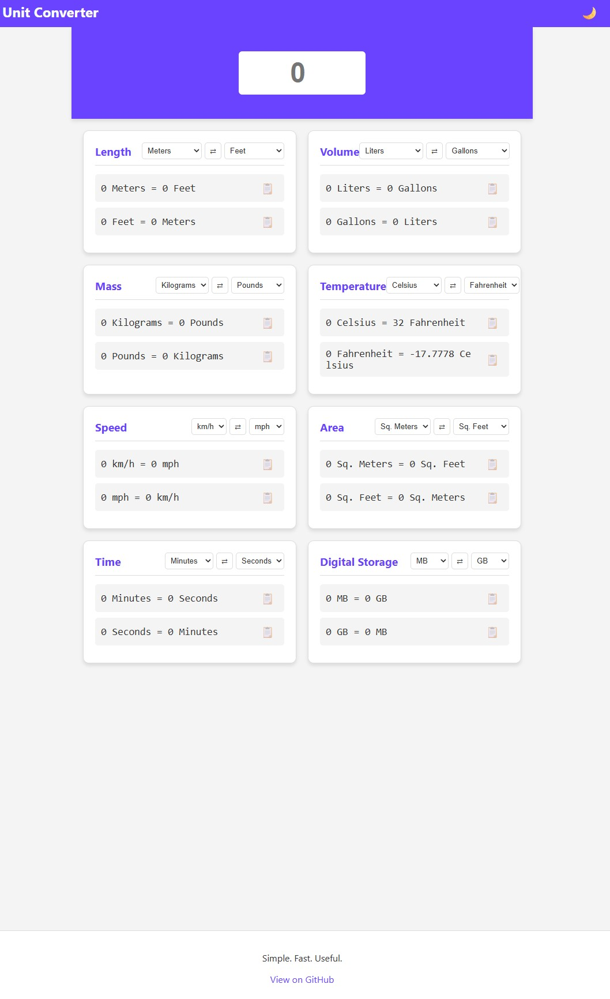

# 📏 Universal Unit Converter

A fast, mobile-friendly tool designed for quick conversions across multiple categories.

## 🚀 Live Demo

**[Check out the Live Production App](https://flipsunitconverter.netlify.app/)** ---

### 📝 Project Overview

* **Problem**: Users need a quick way to convert units like length, volume, and mass on mobile devices without cluttered interfaces.

* **Solution**: A responsive web application featuring real-time conversion, dark mode support, and SEO optimization.

* **Impact**: A live tool demonstrating core front-end development skills and UX design.

### 🛠️ Tech Stack

* **Frontend**: HTML5, CSS3, JavaScript 

* **Deployment**: Netlify 

### 🧪 Features

* **Multi-Category Support**: Length, volume, mass, temperature, speed, area, time, and digital storage.

* **Real-Time Results**: Instant conversion as you type.
* **User Experience**: Fully responsive design with a toggleable Dark Mode.

---

### 📸 Preview

---

### 📂 Repository Structure

* `index.html` - Core structure and SEO.

* `styles.css` - Custom styling and dark mode.

* `index.js` - Real-time conversion logic.

<a href="https://flisunitconverter.netlify.app">Live Demo</a> | <a href="https://github.com/JesseFlip/unitConverter">View Code</a>

